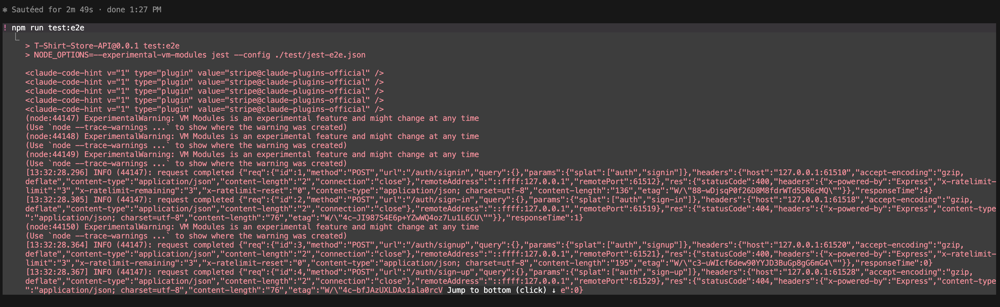
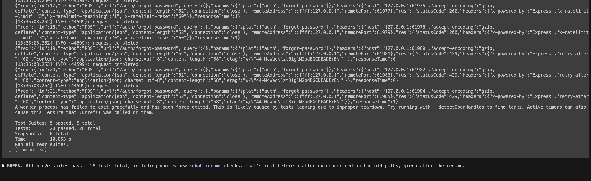
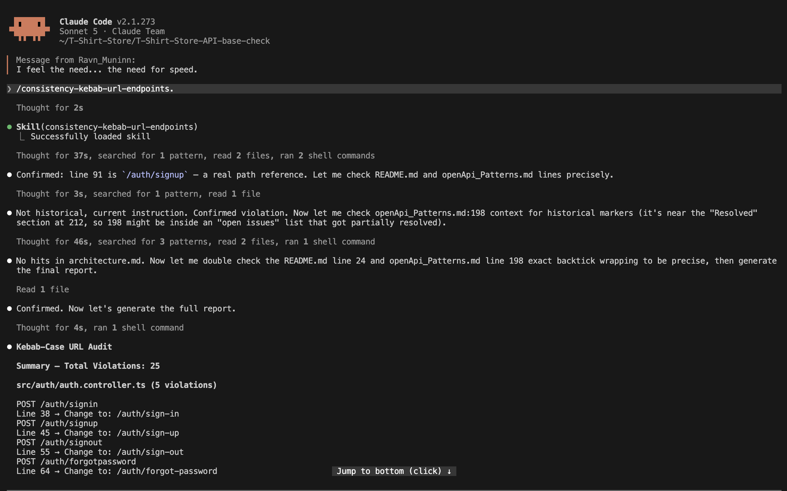
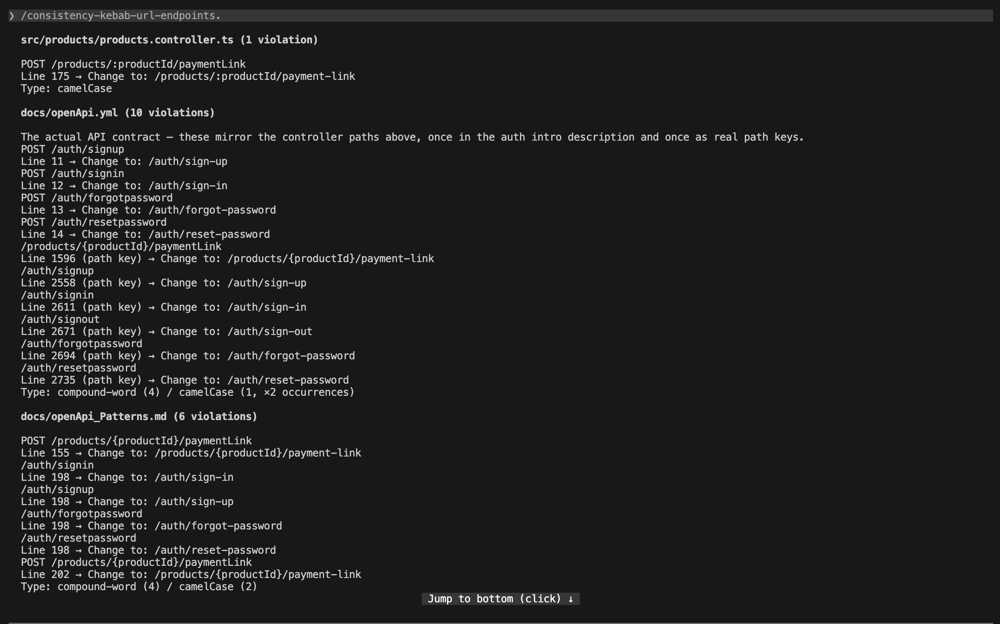
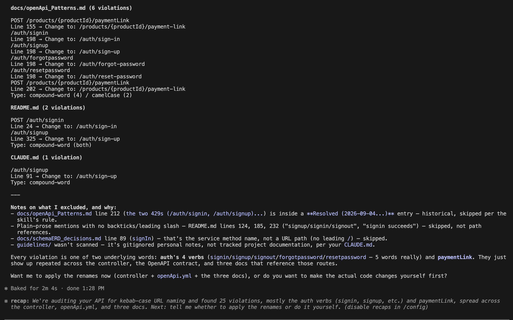
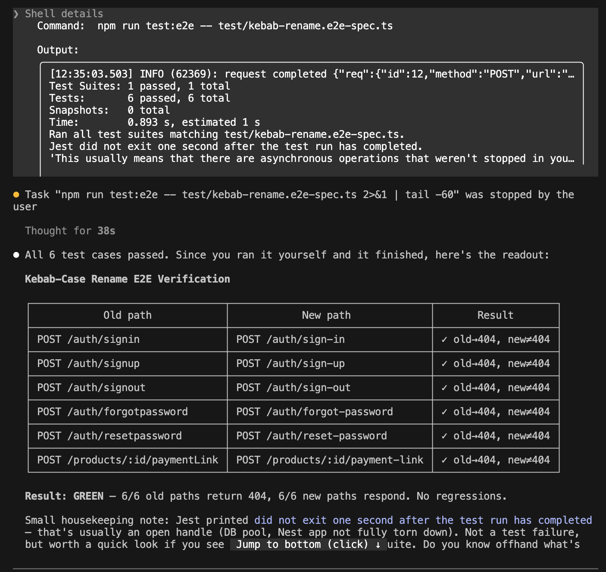

# AI Module - Write-Up

**Repository / PR:** T-Shirt-Store-API, branch `ai-module/kebab-case-urls`

PR link: [Link](https://github.com/CAMIANAIS/T-Shirt-Store-API/pull/1)

**Starting commit:** `57062ba`

**Improvement:** Normalize all API endpoint URLs to kebab-case, a naming decision the team made. Verified by a new e2e test that hits every renamed endpoint: the old path returns nothing (404), the new path responds correctly.

## Skills

| Skill (file link)                                                                                | Goal, inputs → steps → output                                                                                                                                                                                                                                                                                                                                                                    | Exact invocation                   |
| ------------------------------------------------------------------------------------------------ | ------------------------------------------------------------------------------------------------------------------------------------------------------------------------------------------------------------------------------------------------------------------------------------------------------------------------------------------------------------------------------------------------ | ---------------------------------- |
| [consistency-kebab-url-endpoints](../../.claude/skills/consistency-kebab-url-endpoints/SKILL.md) | Goal: find every route whose path isn't kebab-case. Input: none (scans `*.controller.ts` _and_ Markdown docs — `README.md`, `CLAUDE.md`, `docs/**`). Steps: locate route-defining files (not limited to a fixed list of dirs) → extract path segments → flag non-kebab-case, including lowercase compound words (judgment call: `signin` → `sign-in`), while skipping Markdown prose, file paths, and historical/marked-skip entries → report grouped by file, count derived from what was found. Output: a violation list with file:line and the corrected path; hands off the old→new mapping to skill 2. | `/consistency-kebab-url-endpoints` |
| [verify-kebab-rename-e2e](../../.claude/skills/verify-kebab-rename-e2e/SKILL.md)                 | Goal: prove a kebab-case rename didn't break anything, for the right reason. Input: the old→new path pairs from Skill 1, each with one expected status derived from its guards (`401` behind a guard, `422` for an unguarded route given a bad body, or the real success status). Steps: generate an e2e spec that hits each old path (expect 404) and each new path (assert equality against its exact expected status, not just "non-404") → run `npm run test:e2e` before and after the rename. Output: RED/GREEN pass counts and a per-endpoint breakdown; count derived from the mapping, not hardcoded. | `/verify-kebab-rename-e2e`         |

**Notes:**

- Human in the loop: read the outcome from `consistency-kebab-url-endpoints`, apply the renames
  by hand, then hand the old→new mapping to `verify-kebab-rename-e2e`. Frontend/webhook
  consumers of the old paths need to be told about the new ones separately — out of scope for
  this repo.
- **Reused tooling**: skill 1 reads NestJS's own `@Controller()`/`@Get/@Post/@Put/@Patch/@Delete`
  decorators directly — no separate AST parser. Skill 2 adds one spec file into the existing
  `npm run test:e2e` Jest harness rather than a new test runner. Skill 2's expected-status
  assertions are sourced from this project's own documented status-code convention (`CLAUDE.md`
  — `422` for structurally invalid requests, `401`/`403` behind a guard), not invented rules.
- **References**: [Agent Skills](https://code.claude.com/docs/en/skills),
  [Claude Code best practices](https://code.claude.com/docs/en/best-practices),
  [Writing for Agents](https://www.aihero.dev/skills-writing-for-agents),
  [Skill authoring best practices](https://platform.claude.com/docs/en/agents-and-tools/agent-skills/best-practices)
  — from these: putting the trigger-relevant description in frontmatter (not a body heading, since
  that's the text Claude uses to *decide* whether to call the skill), and moving bulky
  report formats/examples into `templates/report-format.md`, loaded only at the reporting step
  instead of on every invocation.
- **Safety / rollback**: both skills are report-first — skill 1 never edits code, only reports
  violations; skill 2 only adds a new test file (`test/kebab-rename.e2e-spec.ts`), it doesn't
  touch existing app code. Renames were applied by hand after reviewing skill 1's report, not
  auto-applied. The rename itself is one isolated commit (`f1c19d3`) — `git revert f1c19d3`
  restores the old paths if needed; the e2e spec file can be deleted independently since no
  production code depends on it. No destructive DB operations were involved, and testing used
  the existing local Docker Postgres + Stripe test-mode setup, not shared or production data.

## Project Results

**Before → after:**

What a plain camelCase regex would have missed:
signin → sign-in (pure lowercase compound, no case shift to trigger regex)
signout → sign-out (same)
forgotpassword → forgot-password (same)

Now all follows the same pattern, they use kebab-case, and there is consistency between all endpoints.

**Manual vs. skill-assisted:**

- *Audit, done by hand*: grep/eyeball each controller file for casing. Misses lowercase compound
  words like `signin`/`forgotpassword` — no case-shift or separator for a regex to catch. A naive
  camelCase/PascalCase/snake_case regex would have found 3 of the 6 real violations, missing the
  three compound-word ones entirely.
- *Verification, done by hand*: writing one e2e test per endpoint, remembering to test both
  directions (old → 404, new → responds), and defining "responds correctly" precisely enough to
  catch a `500`. Easy to get wrong even by hand — the skill's own first draft made exactly this
  mistake ("anything except 404" as the pass condition), caught during PR review, not by the
  skill itself.
- *What needed my judgment, not the skill's*: (1) deciding the audit's scope should include
  Markdown docs, not just controllers — a scope call; (2) reading each endpoint's actual
  `@UseGuards` decorator to decide whether it should expect `401` (guarded) or `422` (unguarded,
  bad body) — required reading the real code, not just the path string; (3) deciding whether a
  stale-looking reference was a live instruction or a historical log entry (e.g.
  `openApi_Patterns.md:212`, dated before the rename) — required reading commit dates, not
  text-pattern matching.

**Evidence:**

Before rename (RED — old paths still exist, new paths don't):

After rename (GREEN — `npm run test:e2e`, 5 suites, 28/28 passing, including the 6 new checks):

Note: all mocked except the real Stripe test-mode webhook call.

**Fresh-session verification:** Both skills were re-run in a brand-new Claude Code session (no
prior conversation), to confirm each `SKILL.md` is self-contained and doesn't depend on context
from the build conversation.

- `/consistency-kebab-url-endpoints`, run **2026-09-16** against the **base commit** (`57062ba`
  / `main`, before the rename, via a disposable `git worktree` — running it against the
  already-renamed branch trivially finds 0 and proves nothing, which is what the first attempt
  at this evidence did wrong):
  
  
  
  Reported **25 violations** — more than the 6 found in controllers alone, because the skill now
  also scans Markdown and `docs/openApi.yml`, which at this pre-rename commit still had the old
  paths too. It correctly excluded the historical log entry, plain-prose mentions with no
  leading `/`, a service method name (`signIn`), and the gitignored `guidelines/` folder — every
  exclusion rule we designed held up against a codebase state the skill had never seen before.
- `/verify-kebab-rename-e2e` → 
  **Pending re-capture** — this screenshot shows a run that was interrupted ("stopped by the
  user"), with no session banner visible, so it isn't valid evidence as-is. Needs a clean,
  uninterrupted fresh-session run against the renamed branch, now asserting the exact expected
  status per endpoint rather than "anything except 404."

**Limitations:** Anything outside this repo that calls the old URLs (frontend, external API consumers) wasn't and couldn't be changed here, those teams need to be told about the new paths separately.

