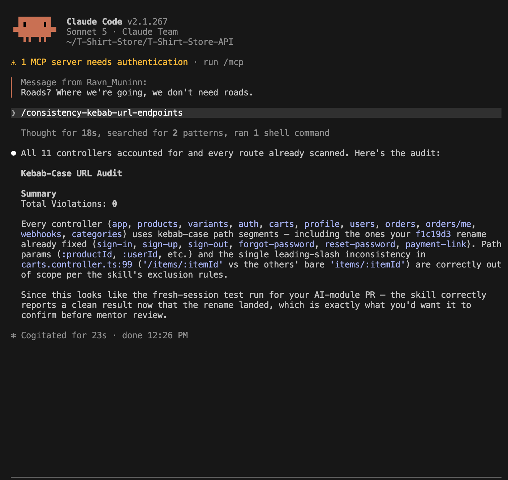

# AI Module - Write-Up

**Repository / PR:** T-Shirt-Store-API, branch `ai-module/kebab-case-urls`

PR link: [Link](https://github.com/CAMIANAIS/T-Shirt-Store-API/pull/1)

**Starting commit:** `57062ba`

**Improvement:** Normalize all API endpoint URLs to kebab-case, a naming decision the team made. Verified by a new e2e test that hits every renamed endpoint: the old path returns nothing (404), the new path responds correctly.

## Skills

| Skill (file link)                                                                                | Goal, inputs → steps → output                                                                                                                                                                                                                                                                                                                                                                    | Exact invocation                   |
| ------------------------------------------------------------------------------------------------ | ------------------------------------------------------------------------------------------------------------------------------------------------------------------------------------------------------------------------------------------------------------------------------------------------------------------------------------------------------------------------------------------------ | ---------------------------------- |
| [consistency-kebab-url-endpoints](../../.claude/skills/consistency-kebab-url-endpoints/SKILL.md) | Goal: find every NestJS route whose path isn't kebab-case. Input: none (scans all `*.controller.ts`). Steps: locate controller files → extract every `@Controller`/`@Get/@Post/@Put/@Patch/@Delete` path segment → flag camelCase/PascalCase/snake_case _and_ lowercase compound words (judgment call) → report grouped by file. Output: a violation list with file:line and the corrected path. | `/consistency-kebab-url-endpoints` |
| [verify-kebab-rename-e2e](../../.claude/skills/verify-kebab-rename-e2e/SKILL.md)                 | Goal: prove a kebab-case rename didn't break anything. Input: the old→new path pairs from Skill 1. Steps: generate an e2e spec that hits each old path (expect 404) and each new path (expect not-404) → run `npm run test:e2e` before and after the rename. Output: RED/GREEN pass counts and a per-endpoint breakdown.                                                                         | `/verify-kebab-rename-e2e`         |

**Notes:** human in the loop for read the outcome from first skill consistency-kebab-url-endpoint and make changes on the endpoints so it is able to see list of endpoints changed and communicate to frontend to change the webhook setup.

**Why not Ralph (AFK loop):** considered it, didn't apply it. Ralph's value is looping unsupervised over a *backlog* of many tasks without re-explaining context each time. This work was one bounded change (6 endpoints, one PR), not a backlog — nothing to loop over. It's also the step that most needs a human, not less: applying a route rename to live API endpoints is a change other teams (frontend) depend on, so it goes through a human checkpoint (skill 1's report → I apply it) before anything ships. A fully AFK pipeline could merge that kind of change with no review, which is the wrong tradeoff here.

## Project Results

**Before → after:**

What a plain camelCase regex would have missed:
signin → sign-in (pure lowercase compound, no case shift to trigger regex)
signout → sign-out (same)
forgotpassword → forgot-password (same)

Now all fllows the same pattern they use kebab-case and there is consistency between all endpoints

**Evidence:**

Before rename (RED — old paths still exist, new paths don't):

After rename (GREEN — `npm run test:e2e`, 5 suites, 28/28 passing, including the 6 new checks):

Note: all mocked except the real Stripe test-mode webhook call.

**Fresh-session verification (2026-09-10):** Both skills were re-run in a brand-new Claude Code session (no prior conversation) against the already-renamed codebase, to confirm each `SKILL.md` is self-contained and doesn't depend on context from the build conversation.

- `/consistency-kebab-url-endpoints` → 
  Reported **0 violations** across all 11 controllers — correct, since the rename was already applied.
- `/verify-kebab-rename-e2e` → 
  **6/6** old→new endpoint pairs passed (old paths 404, new paths respond). Result: GREEN.

**Limitations:** Anything outside this repo that calls the old URLs (frontend, external API consumers) wasn't and couldn't be changed here, those teams need to be told about the new paths separately.
