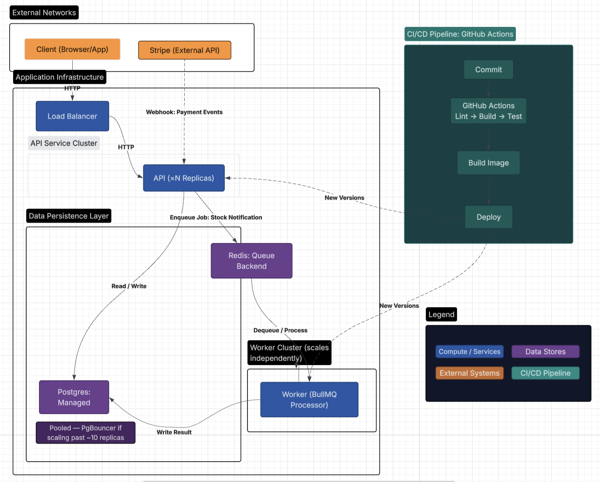
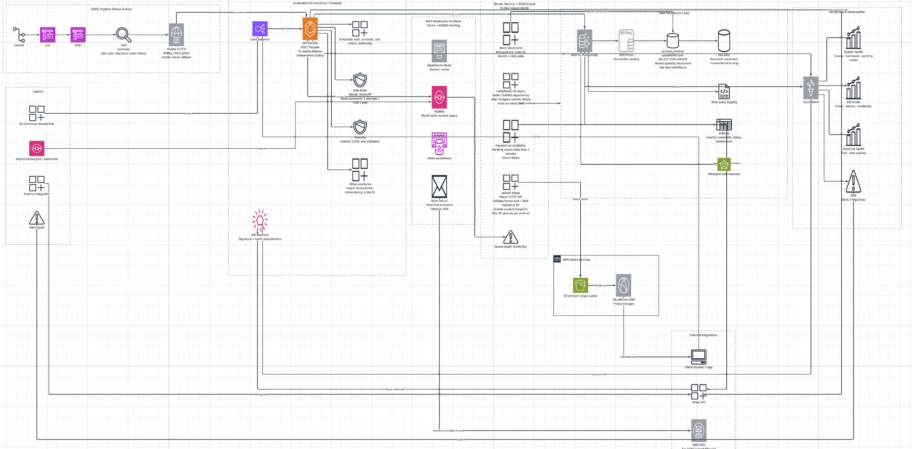

# T-Shirt Store API — Production Architecture

[Link to Diagrams on Lucid](https://lucid.app/lucidchart/96dcfd19-f42c-492a-8698-97cf7bb118e6/edit?viewport_loc=-367%2C-43%2C2626%2C1473%2C0_0&invitationId=inv_bff82dc0-2016-4d4b-87bd-cb16ef3e8c46)

## 1. Diagram

## Bonus: AWS style version

[Link to Diagrams on Lucid](https://lucid.app/lucidchart/96dcfd19-f42c-492a-8698-97cf7bb118e6/edit?viewport_loc=-367%2C-43%2C2626%2C1473%2C0_0&invitationId=inv_bff82dc0-2016-4d4b-87bd-cb16ef3e8c46)

## 2. Rationale

- Queue (BullMQ): I chose BullMQ because it runs on the Redis instance and it integrates natively, and handles complex job lifecycle features (like delays, retries, and priorities) out of the box. Rabbit and Kafka are used for multiple independent services that must communicate async, e.g. streaming.
  I will consider to Switch condition: if te app scale to multiple services, or need cross-service events.
- What comes off the request path: only the stock-notification email (BullMQ/Redis). Everything
  else — auth, cart, checkout, order history — is synchronous, since none of it has a slow
  external dependency in the same way an email send does. A failed notification job retries 3x
  with exponential backoff (5s base); after that it sits in Redis's failed set unrequeued, with
  nothing currently watching it — a real observability gap, not a solved problem.
- Deploy shape: I decide to separate [API and worker], worker scales independently. Postgres and Redis managed separately.
  What happen on migrations: for example add new column first, remove old one after deploy,two separate steps(expand-contract). On rollback: migration stays since it was additive, only the code gets rolled back.
  And on the diagram API and worker are separate deployable units, the pipeline can push a new version to either one without touching the other. It doesn't mean every deploy always updates both at the same time.
- Monitoring: I would take stock consistency, this matters for stocking decisions. SKU race, for user experience so show them the right status code and what exactly happened. And the layer of authorization with CASL matters because users cannot manage products, as an example.

## 3. Known risks

- Partial failure: Order is paid but stock wasn't reduced → risk: overselling, we could sell more than we have → fix: idempotency key on the order id.
- Top OWASP risks:
  - role check on product creation (BFLA — Broken Function Level Authorization), - session not revoked on password reset (Broken Authentication)
  - SKU race condition (inconsistent error handling .Right now the DB's UNIQUE constraint already blocks that; the real issue is a raw 500 instead of a clean 409 under concurrency).
- E2E/regression gap: Without e2e testing I cannot catch if one user has access to create products.
- Connection pooling: Per-instance limiting is best [for now], I need to focus on preventing overselling though. I would use PgBouncer after my limit of 10 replicas.

## 4. How do you know it still works

- E2E coverage: authentication, checkout (asserts the real post-payment stock count, not just a
  200), and order history (asserts cross-client isolation — one client can't see another's
  orders) are covered end to end, running against a real Postgres via Testcontainers rather than
  mocks.
- Named regression that would reach production unnoticed today: the Stripe webhook idempotency
  guard (`stripe_events`, unique on `stripe_event_id`) inserts its row _before_ the payment
  transaction runs, and only marks it `processed` at the end. If that transaction throws partway
  (a transient DB error), the row is still there marked "seen." Stripe automatically retries a
  failed webhook delivery, but the retry hits that same row, is treated as a duplicate, and does
  nothing — the order is silently stuck unpaid forever. No test exercises "webhook processing
  fails once, then Stripe retries," so this would only surface as a real customer's order never
  clearing.
